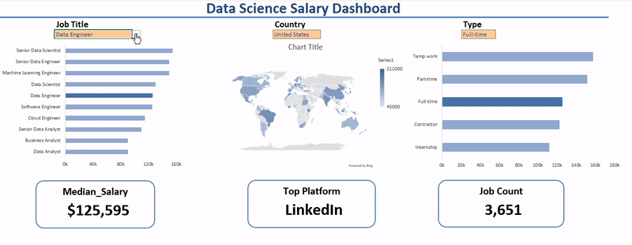
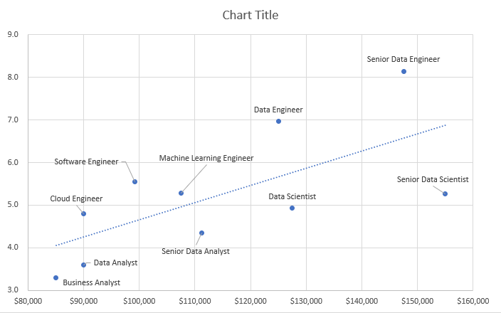
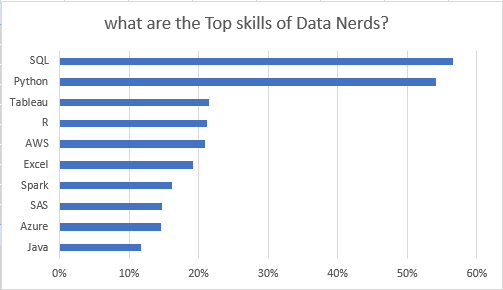

# My Excel Data Analysis Projects
This projects was meant to demonstrate some of the relevant skills needed as a Data Analyst using Excel. It contains two projects, project one is the Data Science Salary Dashboard that would help job seekers compare different Data jobs while filtering for specific countries and their schedule type. However project two focus more on advance salary analysis. This includes the top skills required for each job and weather there exist a relationship between the median salary of a job and the number of skills it requires.  
## Salary Dashboard  
This helps job seekers compare the median salary of all data jobs in different countries. It allows them to filter for the job title, the country of posting and the job schedule type, thus whether they are full-time, part-time,temprary work or even internship.  
[See Details here](project1)  
    

## Salary Analysis  
This project set to understand, for every Data job what are the top skills required to get employed and also as to whether the number of skills required for each job would have an effect on the Average Salary to be expected.  
[See Details here](project2)  
  
  
 
